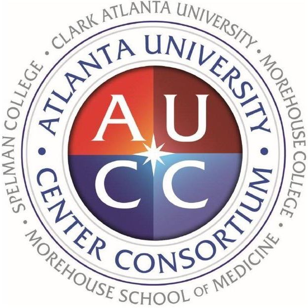
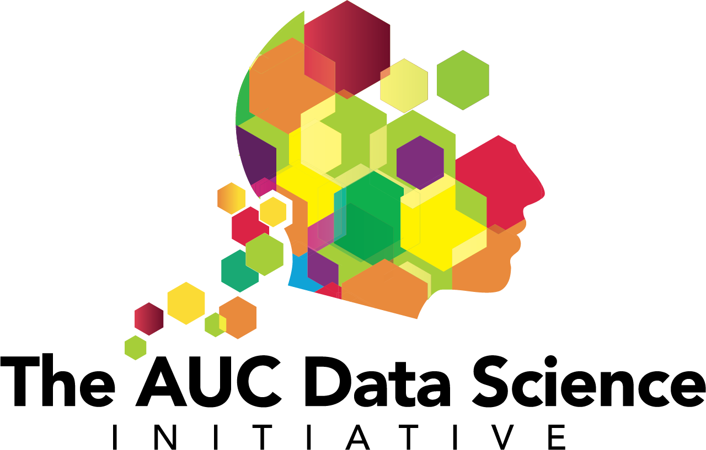

<head>
  <link rel="shortcut icon" type="image/x-icon" href="images/favicon/favicon.ico">
</head>
<!--  -->

 

# Data Science for All
### *Atlanta University Center Data Science Initiative*

The Atlanta University Center (AUC) is comprised of 4 HBCUs: Spelman College, Morehouse College, Clark Atlanta University and The Morehouse School of Medicine.  DS4ALL is a common introductory data science course designed with zero pre-requisites.

The overarching impetus for the course is the realization that, in an increasingly data-driven world, student competitiveness in the upcoming decades will require that every student, regardless of his or her chosen area of specialization, will need the capacity to 

1. reason sensibly based on data
2. make and interpret inferences using data
3. understand the social and ethical implications of data

The course is python-based and is administered through a Zoom Virtual Classroom.

    <!-- <a href="https://spelman.zoom.us/j/227593650"> -->
    <a href="https://spelman.zoom.us/j/94016778484">&nbsp;&nbsp;&nbsp;&nbsp;DS4ALL Virtual Classroom</a>

  
Homework, labs, assignments and course contents are completed in Jupyter notebooks hosted on a JupyterHub Server.

    DS4ALL Course Materials&nbsp;&nbsp;&nbsp;&nbsp;
    

<table style="border: 0px solid lightgrey;" align="center">
<!--  Template:  copy and paste for each new calendar year
    <tr style="background:white;" align="center">
        <td style="border: 1px solid lightgrey;"><a href="FaYYYY/course_materials.md"><b><i></i></b></a></td>
        <td style="border: 1px solid lightgrey;"><a href="SuYYYY/course_materials.md"><b><i></i></b></a></td>
        <td style="border: 1px solid lightgrey;"><a href="SpYYYY/course_materials.md"><b><i>Spring YYYY</i></b></a></td>
    </tr>
-->
<!--  Uncomment for Spring 2021
    <tr style="background:white;" align="center">
        <td style="border: 1px solid lightgrey;"><a href="Fa2021/course_materials.md"><b><i></i></b></a></td>
        <td style="border: 1px solid lightgrey;"><a href="Su2021/course_materials.md"><b><i></i></b></a></td>
        <td style="border: 1px solid lightgrey;"><a href="Sp2021/course_materials.md"><b><i>Spring 2021</i></b></a></td>
    </tr>
-->
    <tr style="background:white;" align="center">
        <td style="border: 1px solid lightgrey;"><ax href="Fa2020/course_materials.md"><b><i></i></b></ax></td>
        <td style="border: 1px solid lightgrey;"><a href="Su2020/course_materials.md"><b><i>Summer 2020</i></b></a></td>
        <td style="border: 1px solid lightgrey;"><b><i>Spring 2020</i></b></td>
    </tr>
    <tr style="background:white;" align="center">
        <td style="width:200px;border: 0px solid lightgrey;"></td>
        <td style="width:200px;border: 0px solid lightgrey;"></td>
        <td style="width:200px;border: 0px solid lightgrey;"></td>
    </tr>
</table>

 
DS4ALL is made possible by the support and generosity of multiple partners.
  

<table style="border: 0px solid white;" align="center">
    <tr style="background:white;" align="center">
        <td style="width:250px;"></td>
        <td style="width:250px;"></td>
    </tr>
    <tr style="background:white;" align="center">
        <td style="width:250px;"></td>
        <td style="width:250px;"></td>
    </tr>
</table>

    

<table style="border: 0px solid white;" align="center">
    <tr style="background:white;" align="center">
        <td style="width:200px;border: 1px solid lightgrey;"></td>
        <td style="width:200px;border: 1px solid lightgrey;"></td>
        <td style="width:200px;border: 1px solid lightgrey;"></td>
    </tr>
    <tr style="background:white;" align="center">
        <td style="width:200px;border: 1px solid lightgrey;"></td>
        <td style="width:200px;border: 1px solid lightgrey;"></td>
        <td style="width:200px;border: 1px solid lightgrey;"></td>
    </tr>
</table>

