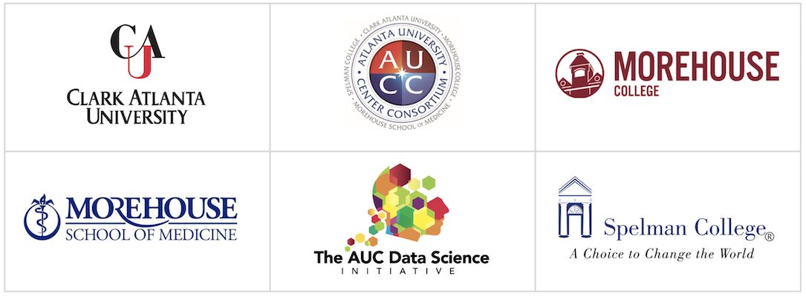

<head>
  <link rel="shortcut icon" type="image/x-icon" href="images/favicon/favicon.ico">
</head>
<!--  -->

 

# Data Science for All
### *Atlanta University Center Data Science Initiative*

The Atlanta University Center (AUC) is comprised of 4 HBCUs: Spelman College, Morehouse College, Clark Atlanta University and The Morehouse School of Medicine.  DS4ALL is a common introductory data science course design with zero pre-requisites.

The overarching impetus for the course is the realization that, in an increasingly data-driven world, student competitiveness in the upcoming decades will require that every student, regardless of his or her chosen area of specialization, will need the capacity to 

1. reason sensibly based on data
2. make and interpret inferences using data
3. understand the social and ethical implications of data

The course is python-based and is administered through jupyter notebooks.

 
DS4ALL is made possible by the support and generosity of multiple partners.
  

<table style="border-spacing: 150px;border: 0px solid red;">
    <tr style="background:white;">
        <td></td>
        <td style="width:70px;"></td>
        <td></td>
    </tr>
    <tr style="background:white;">
        <td></td>
        <td style="width:70px;"></td>
        <td></td>
    </tr>
</table>

    

